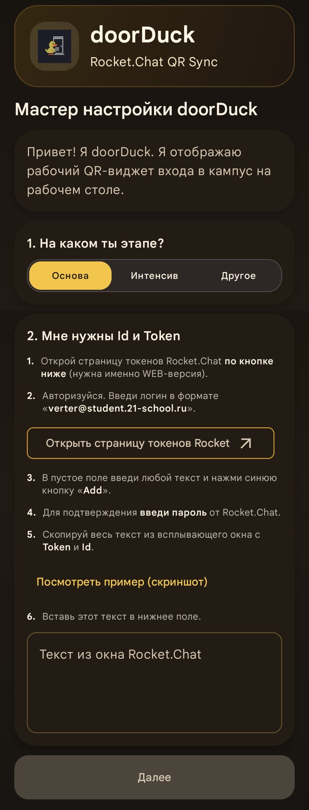
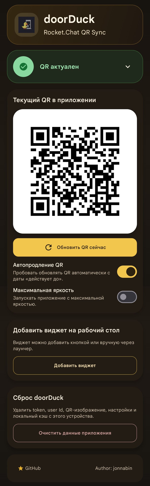
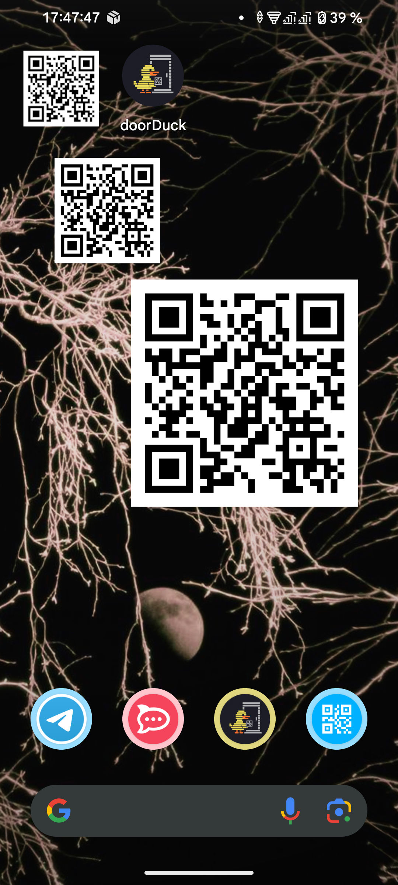

# doorDuck

`doorDuck` — приложение для прохода в кампусы Школы 21. Показывает QR-пропуск в виджете и внутри приложения Android/iOS, автоматически его продлевая.

> [!IMPORTANT]
> `doorDuck` — неофициальный клиент. Проект не связан с АНО «Школа 21», Сбером или Rocket.Chat. Пользователь самостоятельно отвечает за соблюдение правил своей организации, договоров, политик информационной безопасности и применимого законодательства.

## Скачать

[Latest Release](https://github.com/vgy789/doorDuck/releases/latest) | [Download APK](https://github.com/vgy789/doorDuck/releases/latest/download/doorDuck-latest.apk)

Сейчас в релизах публикуется Android APK. iOS-версия собирается из исходников.

<table>
  <tr>
    <td align="center">
      
    </td>
    <td align="center">
      
    </td>
    <td align="center">
      
    </td>
  </tr>
</table>

## Возможности

- Масштабируемый виджет на Android и iOS.
- Автообновление QR по истечении срока действия.
- Увеличение яркости экрана при отображении кода.
- Поддержа RU/EN языков.
- Доступно для студентов, участников отборочного интенсива, сотрудников.

## Приватность и безопасность

Проект является **неофициальным** и разрабатывается независимо. Перед использованием обязательно ознакомьтесь с положениями [Политики конфиденциальности](./.github/PRIVACY.md) и [Инструкциями по безопасности](./.github/SECURITY.md). 

- Приложение не использует сервер автора: запросы отправляются с устройства пользователя напрямую в выбранный Rocket.Chat endpoint.
- Не публикуйте свои `X-Auth-Token`, user ID, QR-коды, скриншоты с приватными данными или логи.

## Секреты сборки

Endpoint-адреса не хранятся в исходниках. Для локальной сборки скопируйте `secrets.properties.example` в `secrets.properties` и заполните значения.

## Архитектура

Проект разделён на три основных модуля:

- `shared` — Kotlin Multiplatform модуль с общей бизнес-логикой, Compose Multiplatform UI для iOS, моделями, строками и platform abstraction.
- `app` — Android-приложение на Jetpack Compose, Android widget, WorkManager, Android storage/network integration.
- `iosApp` — Xcode-проект, который использует `shared` framework и содержит iOS app + WidgetKit extension.

## Технологии

- Kotlin Multiplatform
- Compose Multiplatform
- Jetpack Compose
- WidgetKit
- Jetpack Glance
- WorkManager
- Ktor / Darwin client
- Retrofit + OkHttp
- kotlinx.serialization
- DataStore Preferences
- AndroidX Security Crypto

## Лицензия

[MIT](./LICENSE)
