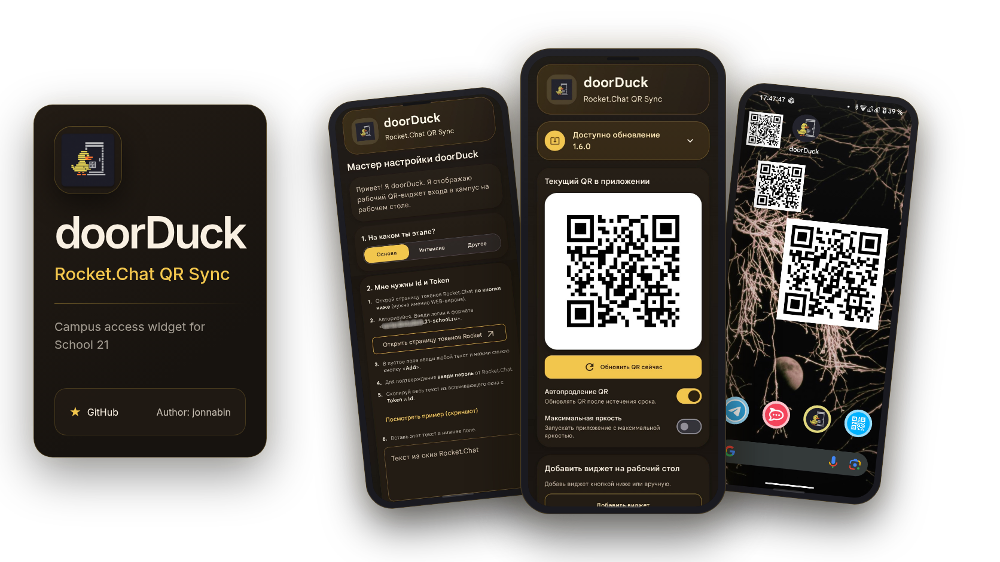

`doorDuck` показывает и обновляет QR-пропуск для кампусов Школы 21 в приложении и виджетах на Android и iOS.

> [!IMPORTANT]
> `doorDuck` — независимый проект, не связанный с АНО «Школа 21», Сбером. Пользователь самостоятельно отвечает за соблюдение правил организации, условий договоров и законодательства.

## Скачать

[Latest Release](https://github.com/vgy789/doorDuck/releases/latest) | [Android APK](https://github.com/vgy789/doorDuck/releases/latest/download/doorDuck-latest.apk) | iOS собирается из исходников

## Возможности

- Масштабируемые виджеты Android/iOS с обновлением QR по истечении срока.
- Повышение яркости при показе кода.
- Русский и английский языки.
- Доступ для студентов, участников интенсива и сотрудников.

## Приватность и безопасность

Запросы идут с устройства напрямую в Rocket.Chat, без сервера автора. Подробнее: [конфиденциальность](./.github/PRIVACY.md) и [безопасность](./.github/SECURITY.md).

## Секреты сборки

Адресов API нет в исходниках. Для сборки заполните `secrets.properties` по примеру `secrets.properties.example`.

## Архитектура

- `shared` — общая логика, модели, ресурсы, платформенные абстракции и Compose UI для iOS.
- `app` — Android-приложение и виджет, сеть, хранилище и WorkManager.
- `iosApp` — iOS-приложение и WidgetKit extension на основе `shared`.

## Технологии

Kotlin и Compose Multiplatform, Jetpack Compose, WidgetKit, Glance, WorkManager, Ktor, Darwin client, Retrofit, OkHttp, kotlinx.serialization, DataStore и AndroidX Security Crypto.

## Лицензия

[MIT](./LICENSE)